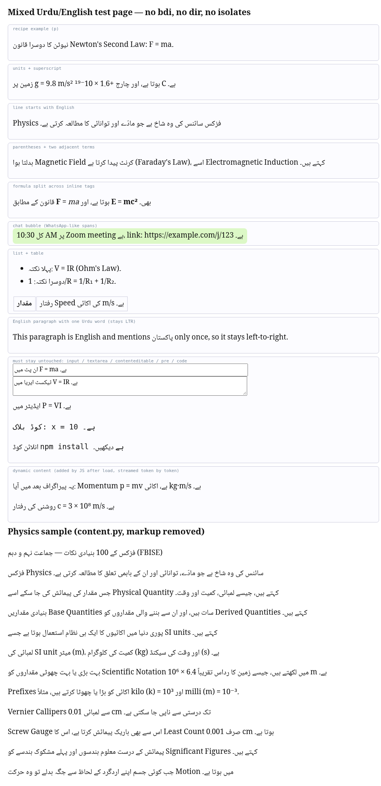
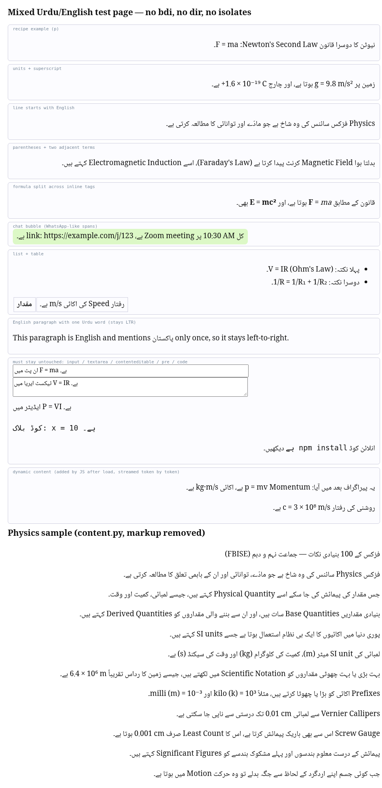
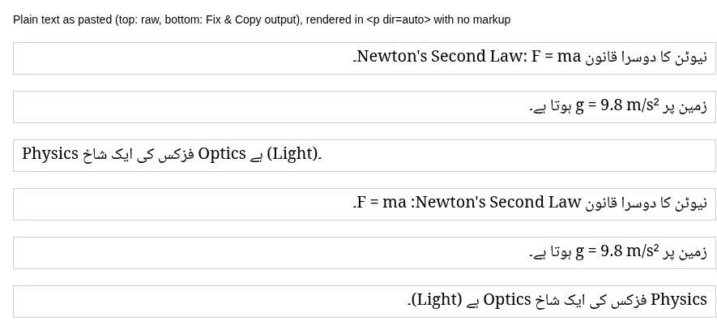

# Urdu RTL Fixer

**Fix the display order of Urdu (and Arabic, Persian, Pashto, Sindhi) text that is mixed with English words, numbers and formulas.**

This repo contains two tools that share one small bidi engine:

| Folder | What it is |
|---|---|
| [`extension/`](extension/) | A Chrome / Edge extension (Manifest V3) that fixes mixed text on any web page and gives you a "Fix & Copy" button for WhatsApp, Word and email. |
| [`mcp-server/`](mcp-server/) | A local MCP server (stdio) so AI assistants can fix plain text and HTML, check it, and render a preview. |
| [`docs/RTL-MIXED-TEXT-RECIPE.md`](docs/RTL-MIXED-TEXT-RECIPE.md) | The recipe both tools follow, for anyone who wants to fix mixed RTL text by hand. |
| [`screenshots/`](screenshots/) | Before/after images. |

## The problem

Write a sentence in Urdu that contains an English term or a formula, and the screen often shows it in the wrong order:

> نیوٹن کا دوسرا قانون Newton's Second Law: F = ma۔

can appear as `ma = F`, `9.8 m/s²` breaks apart, a full stop or bracket jumps to the wrong end, and two English terms swap places. This happens because the Unicode Bidirectional Algorithm treats digits, spaces and symbols such as `= + / ( ) .` as *neutral*: they take their direction from their neighbours.

**The fix is to isolate every left-to-right run** so it behaves like one unbreakable block, rather than to pad it with spaces:

* **HTML:** put the paragraph in `dir="rtl"` and wrap each English/number/formula run in `<bdi dir="ltr">…</bdi>`.
* **Plain text** (WhatsApp, Word, SMS, email): add an RLM (U+200F) at the start of each Urdu line and wrap each LTR run in FSI (U+2068) … PDI (U+2069). These characters are invisible.

The full explanation is in [`docs/RTL-MIXED-TEXT-RECIPE.md`](docs/RTL-MIXED-TEXT-RECIPE.md).

## Before / after

| Before (extension off) | After (extension on) |
|---|---|
|  |  |

Plain text as pasted (top 3 lines: raw; bottom 3 lines: "Fix & Copy" output):



More images: [optional Nastaliq font](screenshots/after-nastaliq.png), [popup](screenshots/popup.png), [MCP `render_preview` output](screenshots/mcp-render-preview.png).

## 1. Browser extension (Chrome / Edge)

It is not in any store yet. Install it with **Load unpacked**:

1. Download this repo (**Code → Download ZIP**, then unzip) or `git clone` it.
2. Open `chrome://extensions` (Chrome) or `edge://extensions` (Edge).
3. Turn on **Developer mode**.
4. Click **Load unpacked** and choose the **`extension/`** folder (the one that contains `manifest.json`).
5. Pin "Urdu RTL Fixer" from the puzzle-piece menu, and reload tabs that were already open.

What it does:

* **Auto-fix on web pages:** RTL paragraphs get `dir="rtl"` and every English/number/formula run is wrapped in `<bdi dir="ltr">`. New content (ChatGPT, Gmail, WhatsApp Web…) is fixed as it arrives. Input boxes, `textarea`, editable areas, `code` and `pre` are never touched. Turning it off for a site restores the original page.
* **Popup:** on/off everywhere or per site, an optional bundled **Noto Nastaliq Urdu** font (works offline), and a **Fix & Copy** box for text you want to paste into WhatsApp, Word, Notes or email.
* **Right-click:** select text → **Copy fixed for WhatsApp/Word**.

The extension makes no network requests. Details: [`extension/README.md`](extension/README.md), Roman Urdu install guide: [`extension/INSTALL.md`](extension/INSTALL.md).

Tests: `cd extension && node --test test/` (unit tests). An optional end-to-end test with headless Chrome is `python3 test/e2e_test.py` (needs `pip install playwright pillow` and Google Chrome).

## 2. MCP server

A local stdio [Model Context Protocol](https://modelcontextprotocol.io) server with five tools: `fix_plain_text`, `fix_html`, `check_text`, `strip_marks` and `render_preview`.

```bash
cd mcp-server
npm install            # Node 18 or newer
cd ..
node mcp-server/server.js
```

To use it from an MCP client, add a server entry like this (use your own absolute path):

```json
{
  "mcpServers": {
    "urdu-rtl-fixer": {
      "command": "node",
      "args": ["/absolute/path/to/urdu-rtl-fixer/mcp-server/server.js"]
    }
  }
}
```

The server makes no network calls and needs no API keys. `render_preview` additionally needs Python with Playwright and Google Chrome (see `URF_PYTHON`, `URF_CHROME` in [`mcp-server/README.md`](mcp-server/README.md)). Tests: `cd mcp-server && npm test`.

`mcp-server/lib/bidi.cjs` is a byte-identical copy of `extension/bidi.js`; the MCP test checks that they match.

## Roman Urdu mein

Jab Urdu jumlay mein English alfaaz, numbers ya formula (jaise `F = ma`, `9.8 m/s²`) aate hain to screen par tarteeb ulat jaati hai. Yeh repo is masle ko hal karta hai: har English/number/formula hissay ko alag "isolate" kar deta hai (spaces daal kar nahi).

* **Extension:** `chrome://extensions` (ya `edge://extensions`) kholein → **Developer mode** on → **Load unpacked** → is repo ka `extension` folder chunein. Poori guide: [`extension/INSTALL.md`](extension/INSTALL.md).
* **WhatsApp / Word ke liye:** extension ke popup mein text paste karein → **Fix & Copy** → phir paste karein.
* **MCP server:** `cd mcp-server && npm install`, phir `node mcp-server/server.js`.

## License

Code: [MIT](LICENSE), © 2026 AI4Kids / Iftekhar.
The bundled font `extension/fonts/NotoNastaliqUrdu-Regular.ttf` is © The Noto Project Authors and licensed under the [SIL Open Font License 1.1](extension/fonts/OFL.txt).
